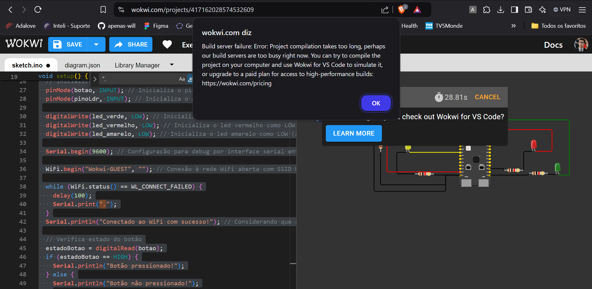

# Prova Módulo 3 2024 - Sistema IoT

O presente código implementa um semáforo usando o microprocessador ESP32, 3 leds, 1 botão e um sensor de luminosidade (LDR), de modo que haja diferenças no comportamento dos ciclos do semáforo a depender do estado do botão (pressionado ou solto) e do nível de luminosidade. Ambas as implementações para alteração de ciclo visam simular situações reais, nas quais o tempo do semáforo pode se alterar dependendo do horário do dia (e consequentemente, nível de luminosidade do ambiente) e se um pedestre deseja ou não atravessar (definido pelo botão pressionado).

Devido a falhas de conexão, não foi possível compilar o código para verificar o seu funcionamento:

